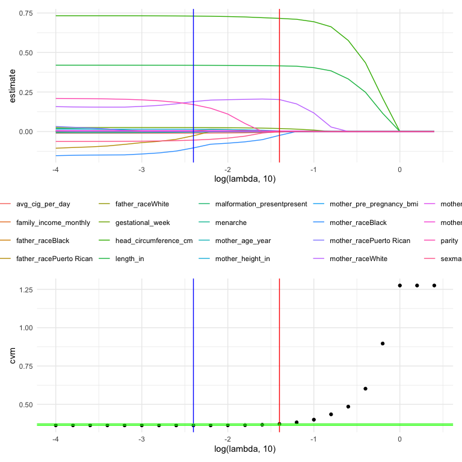
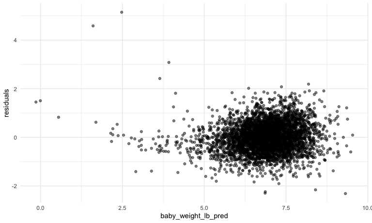
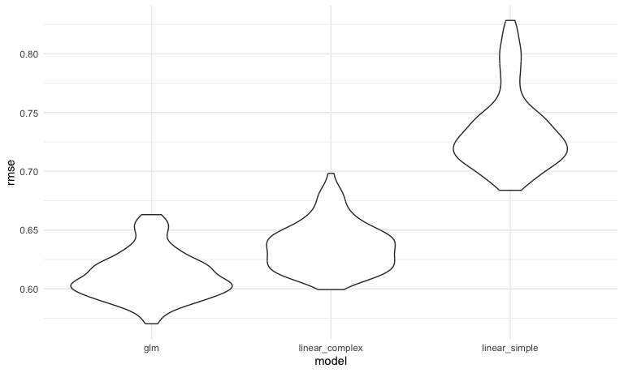

HW 6
================
Shivalika Chavan
2025-11-21

``` r
library(tidyverse)
```

    ## ── Attaching core tidyverse packages ──────────────────────── tidyverse 2.0.0 ──
    ## ✔ dplyr     1.1.4     ✔ readr     2.1.5
    ## ✔ forcats   1.0.0     ✔ stringr   1.5.1
    ## ✔ ggplot2   3.5.2     ✔ tibble    3.3.0
    ## ✔ lubridate 1.9.4     ✔ tidyr     1.3.1
    ## ✔ purrr     1.1.0     
    ## ── Conflicts ────────────────────────────────────────── tidyverse_conflicts() ──
    ## ✖ dplyr::filter() masks stats::filter()
    ## ✖ dplyr::lag()    masks stats::lag()
    ## ℹ Use the conflicted package (<http://conflicted.r-lib.org/>) to force all conflicts to become errors

``` r
library(p8105.datasets)
library(rvest)
```

    ## 
    ## Attaching package: 'rvest'
    ## 
    ## The following object is masked from 'package:readr':
    ## 
    ##     guess_encoding

``` r
library(glmnet)
```

    ## Loading required package: Matrix
    ## 
    ## Attaching package: 'Matrix'
    ## 
    ## The following objects are masked from 'package:tidyr':
    ## 
    ##     expand, pack, unpack
    ## 
    ## Loaded glmnet 4.1-10

``` r
library(patchwork)
library(modelr)
library(mgcv)
```

    ## Loading required package: nlme
    ## 
    ## Attaching package: 'nlme'
    ## 
    ## The following object is masked from 'package:dplyr':
    ## 
    ##     collapse
    ## 
    ## This is mgcv 1.9-3. For overview type 'help("mgcv-package")'.

``` r
knitr::opts_chunk$set(echo = TRUE)
knitr::opts_chunk$set(collapse = TRUE)
knitr::opts_chunk$set(
  fig.width = 8,
  fig.asp = .6,
  out.width = "90%"
)
theme_set(theme_minimal() + theme(legend.position = "bottom"))
```

#### Problem 1

``` r
omitted_city_states = c("Dallas, TX", "Phoenix, AZ","Kansas City, MO", "Tulsa, AL")

homicide_data = read.csv("./data/homicide-data.csv") |> 
  janitor::clean_names() |> 
  mutate(
    city_state = paste0(city, ", ", state),
    homicide_solved = as.numeric(disposition == "Closed by arrest"),
    victim_age = if_else(victim_age == "Unknown", NA, victim_age),
    victim_age = as.numeric(victim_age)
  ) |> 
  filter(
    !(city_state %in% omitted_city_states)
  )
```

Additional filtering for only Problem 1:

``` r
homicide_data_problem_1 = 
  homicide_data |> 
  filter(victim_race %in% c("White", "Black"))
```

For Baltimore:

``` r
homicide_data_1_glm = 
  homicide_data_problem_1 |> 
  filter(city_state == "Baltimore, MD") |> 
  glm(formula = homicide_solved ~ victim_age + victim_sex + victim_race, data = _, family = binomial()) 

estimate_CI_OR_sex = homicide_data_1_glm |> 
  broom::tidy(conf.int = TRUE, exponentiate = TRUE) |>
  filter(term == "victim_sexMale") |> 
  select(estimate, conf.low, conf.high)

estimate_CI_OR_sex
## # A tibble: 1 × 3
##   estimate conf.low conf.high
##      <dbl>    <dbl>     <dbl>
## 1    0.426    0.324     0.558
```

Mapping to all cities

``` r
extract_estimate_OR_sex = function(city){
  
  estimates = 
    homicide_data_problem_1 |>
    filter(city_state == !!city) |>
    glm(formula = homicide_solved ~ victim_age + victim_race + victim_sex, data = _, family = binomial()) |>
    broom::tidy(conf.int = TRUE, exponentiate = TRUE) |>
    filter(term == "victim_sexMale") |>
    select(estimate, conf.low, conf.high)
  
  estimates
  
}

estimates_ORs_city = 
  tibble(
    city = unique(pull(homicide_data_problem_1, city_state))
    ) |> 
  mutate(glm_model_estimates = map(city, extract_estimate_OR_sex)) |> 
  unnest(glm_model_estimates)
## Warning: There were 43 warnings in `mutate()`.
## The first warning was:
## ℹ In argument: `glm_model_estimates = map(city, extract_estimate_OR_sex)`.
## Caused by warning:
## ! glm.fit: fitted probabilities numerically 0 or 1 occurred
## ℹ Run `dplyr::last_dplyr_warnings()` to see the 42 remaining warnings.
```

Plotting:

``` r
estimates_ORs_city |> 
  mutate(city = fct_reorder(city, estimate)) |> 
  ggplot(aes(x = estimate, y = city)) + 
  geom_point() + 
  geom_errorbarh(aes(xmin = conf.low, xmax = conf.high)) +
  geom_vline(xintercept = 1, color = "red") +
  xlim(0, 4) +
  ylab("City, State") +
  xlab("Estimate of Odds Ratio of Homicide Solved, Male vs. Female (with 95% CI)")
```


An odds ratio of 1 indicates that the odds of a homicide being solved
are equal between male and female victims, keeping all other variables
fixed (`age` and `race`). An odds ratio greater than 1 (right of the red
line) means that homicides where the victims are male have higher odds
of being solved. An odds ratio less than 1 (left of the red line) means
that homicides where the victims are male have lower odds of being
solved. If the CI does not cross 1, then it means that the calculated
odds ratio is statistically significant.

#### Problem 2

``` r
data("weather_df")

bootstrap_sample = function(df){
  
  slice_sample(df, prop = 1, replace = TRUE)
  
}

weather_df_bootstrapped_samples = 
  tibble(iter = 1:5000) |> 
  mutate(
    bootstrapped_sample = map(iter, \(i) bootstrap_sample(df = weather_df)),
    sample_linear_models = map(bootstrapped_sample, \(df) lm(tmax~tmin + prcp, data = df)),
    r_hat_sq = map(sample_linear_models, \(model) model |> broom::glance() |> pull(r.squared)),
    beta_1_hat = map_dbl(sample_linear_models, \(model) model |> broom::tidy() |> filter(term == "tmin") |> pull(estimate)),
    beta_2_hat = map_dbl(sample_linear_models, \(model) model |> broom::tidy() |> filter(term == "prcp") |> pull(estimate)),
    beta_1_2_ratio = beta_1_hat / beta_2_hat
  )
```

``` r
weather_df_bootstrapped_samples |> 
  ggplot(aes(x = beta_1_hat)) + geom_density()
```


``` r

weather_df_bootstrapped_samples |> 
  ggplot(aes(x = beta_2_hat)) + geom_density()
```


β1 appears normally distributed around 1.017. β2 also appears normally
distributed around -0.0057.

``` r
weather_df_bootstrapped_samples |> 
  select(beta_1_hat, beta_2_hat) |> 
  pivot_longer(
    cols = c(beta_1_hat, beta_2_hat),
    names_to = "estimate",
    values_to = "value"
  ) |> 
  group_by(estimate) |> 
  reframe(
    ci.lower = quantile(value, probs = 0.025),
    ci.upper = quantile(value, probs = 0.975)
  ) |> 
  knitr::kable()
```

| estimate   |   ci.lower |   ci.upper |
|:-----------|-----------:|-----------:|
| beta_1_hat |  1.0057928 |  1.0278618 |
| beta_2_hat | -0.0081436 | -0.0036662 |

#### Problem 3

``` r
birthweight = read.csv("https://p8105.com/data/birthweight.csv") |> 
  mutate(
    
    sex = case_match(
      babysex,
      1 ~ "male", 
      2 ~ "female"
    ),
    sex = as.factor(sex),
    
    length_in = blength / 2.54,
    head_circumference_cm = bhead / 2.54,
    baby_weight_lb = bwt / 453.6, # converting from grams to lbs
    
    father_race = case_match(
      frace,
      1 ~ "White",
      2 ~ "Black",
      3 ~ "Asian",
      4 ~ "Puerto Rican",
      8 ~ "Other",
      9 ~ "Unknown",
    ),
    father_race = as.factor(father_race),
    
    mother_race = case_match(
      mrace,
      1 ~ "White",
      2 ~ "Black",
      3 ~ "Asian",
      4 ~ "Puerto Rican",
      8 ~ "Other",
      9 ~ "Unknown",
    ),
    mother_race = as.factor(mother_race),
    
    malformation_present = case_match(
      malform,
      0 ~ "absent",
      1 ~ "present"
    ),
    malformation_present = as.factor(malformation_present),
    
    family_income_monthly = fincome * 100
    
  ) |> 
  rename(
    mother_weight_lb = delwt,
    gestational_week = gaweeks,
    mother_height_in = mheight,
    mother_age_year = momage,
    num_previous_low_birthweight = pnumlbw,
    num_previous_small_gest_age = pnumsga,
    mother_pre_pregnancy_bmi = ppbmi,
    mother_pre_pregnancy_weight_lb = ppwt,
    avg_cig_per_day = smoken,
    mother_weight_gain_lb = wtgain
    
  ) |> 
  select(-babysex, -bwt, -blength, -bhead, -frace, -mrace, -malform, -fincome)
```

Proposed Model:

``` r
Y = birthweight |> pull(baby_weight_lb) 
X = model.matrix(baby_weight_lb ~., birthweight)[,-1]
```

Adding lambdas for tuning

``` r
lambda = 10^(seq(-4, 0.5, 0.2)) # penalty in lasso for additional variable

lasso_fit = glmnet(X, Y, lambda = lambda)

lasso_cv = cv.glmnet(X, Y, lambda = lambda)

lambda_min = lasso_cv[["lambda.min"]] # minimum mean cross-validated error
lambda_1se = lasso_cv[["lambda.1se"]] # largest value of λ such that error is within 1 standard error of the cross-validated errors for lambda.min.
CVM_min = lasso_cv |> broom::tidy() |> filter(lambda == lambda_min) |> pull(estimate)
CVM_1se = lasso_cv |> broom::tidy() |> filter(lambda == lambda_1se) |> pull(estimate)
```

Plotting both `lambda_min` and `lambda_1se`:

``` r
coeff_estimates = 
  lasso_fit |> 
    broom::tidy() |> 
    select(term, lambda, estimate) |> 
    complete(term, lambda, fill = list(estimate = 0)) |> 
    filter(term != "(Intercept)") |> 
    ggplot(aes(x = log(lambda, 10), y = estimate, group = term, color = term)) + 
    geom_line() + 
    geom_vline(xintercept = log(lambda_min, 10), color = "blue") + 
  geom_vline(xintercept = log(lambda_1se, 10), color = "red")


cvm_log_lambda = 
  lasso_cv |> 
    broom::tidy() |> 
  mutate(
    cvm = estimate # mean cross-validated error
  ) |> 
    ggplot(aes(x = log(lambda, 10), y = cvm)) +
    geom_point() + 
  geom_vline(xintercept = log(lambda_min, 10), color = "blue") + 
  geom_vline(xintercept = log(lambda_1se, 10), color = "red") + 
  geom_hline(yintercept = CVM_min, color = "green") + 
  geom_hline(yintercept = CVM_1se, color = "green") 

coeff_estimates / cvm_log_lambda
```



Nearly all predictors are selected with `lambda_min` (in blue) and fewer
predictors are selected with `lambda_1se` (in red). However, the mean
cross-validated error stays the same (within 0.009). This means that the
keeping those additional predictors doesn’t improve the predictive
accuracy by a lot and it makes more sense to pick the more simple model
using the higher tuning parameter (`lambda_1se`).

Running LASSO with `lambda_1se` = 0.04

``` r
lasso_fit_lambda_1se = glmnet(X, Y, lambda = lambda_1se)
```

Adding predictions, residuals, and plotting

``` r
birthweight_predictions = 
  birthweight |> 
  select(baby_weight_lb) |> 
  mutate(
    baby_weight_lb_pred = predict(lasso_fit_lambda_1se, newx = X)[,1],
    residuals = baby_weight_lb - baby_weight_lb_pred
  )

birthweight_predictions |>
  ggplot(aes(x = baby_weight_lb_pred, y = residuals)) +
  geom_point(alpha = 0.5)
```



Yay, it looks like a cloud! This means there is no observable
relationship (or bias) between the fitted values and the residuals.

Now need to compare to two other models, both of which are linear.
Making functions for each of these. The glm model will use the same
`lambda_1se` tuning parameter that was determined in previous steps.

``` r
glm_fit_lambda_1se = function(df) {
  
  Y = df |> pull(baby_weight_lb) 
  X = model.matrix(baby_weight_lb ~., df)[,-1]
  glmnet(X, Y, lambda = lambda_1se)
  
}

linear_fit_simple = function(df) {
  
  lm(baby_weight_lb ~ length_in + gestational_week, data = df)
  
}

linear_fit_complex = function(df) {
  
  lm(baby_weight_lb ~ 
       head_circumference_cm + length_in + sex + 
       head_circumference_cm*length_in + 
       head_circumference_cm * sex + 
       length_in * sex + 
       head_circumference_cm * length_in * sex, 
     data = birthweight)
  
}
```

Also making a function to add RMSE for the glm models

``` r
rmse_glm_predictions = function(model, df) {
  
  X = model.matrix(baby_weight_lb ~., df)[,-1]
  
  df =
    df |> 
    mutate(pred = predict(model, newx = X)[,1]) 
  
  actual = df |> pull(baby_weight_lb)
  predicted =  df |> pull(pred)
                      
  rmse = sqrt(mean((actual - predicted)^2))
  
  rmse
}
```

Monte Carlo cross-validation following the default 80/20 train/test
split

``` r
cv_df = 
  crossv_mc(birthweight, n = 100) |> 
  mutate(
    train = map(train, as_tibble),
    test = map(test, as_tibble)
  ) |> 
  mutate(
    # fitting models using training data 
    glm_model = map(train, glm_fit_lambda_1se),
    linear_model_simple = map(train, linear_fit_simple),
    linear_model_complex = map(train, linear_fit_complex)
  ) |> 
  mutate(
    # adding RMSE
    rmse_glm = map2_dbl(glm_model, test, rmse_glm_predictions),
    rmse_linear_simple = map2_dbl(linear_model_simple, test, rmse),
    rmse_linear_complex = map2_dbl(linear_model_complex, test, rmse)
  )
```

``` r
cv_df |> 
  select(starts_with("rmse")) |> 
  pivot_longer(
    everything(),
    names_to = "model", 
    values_to = "rmse",
    names_prefix = "rmse_") |> 
  ggplot(aes(x = model, y = rmse)) + 
  geom_violin()
```



We can see that the RMSE for the GLM model, optimized with lasso and
using tuning parameter 0.04, is slightly lower compared to the RMSE for
the second (more complex) linear model, which takes into account several
interactions. The RMSE for the simple linear model is much higher
compared to the other two. The mean RMSE from the cross vaidation are
summarized in the table below:

| model          | mean_RMSE |
|:---------------|----------:|
| glm            |     0.610 |
| linear_complex |     0.633 |
| linear_simple  |     0.734 |
