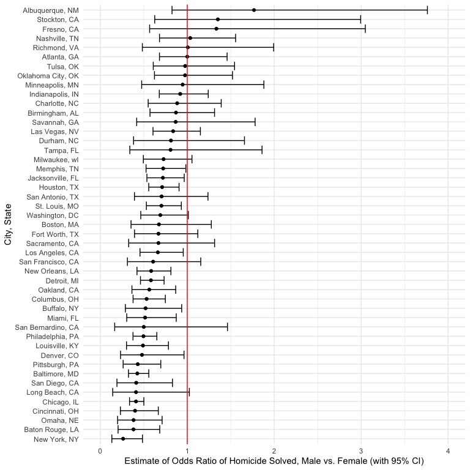
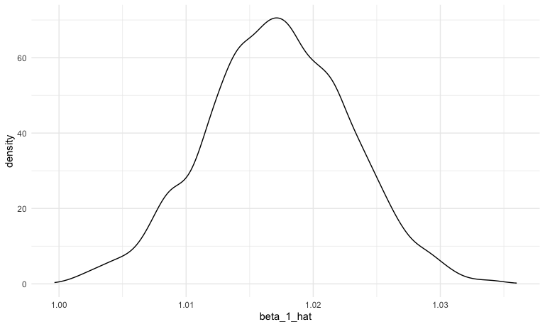
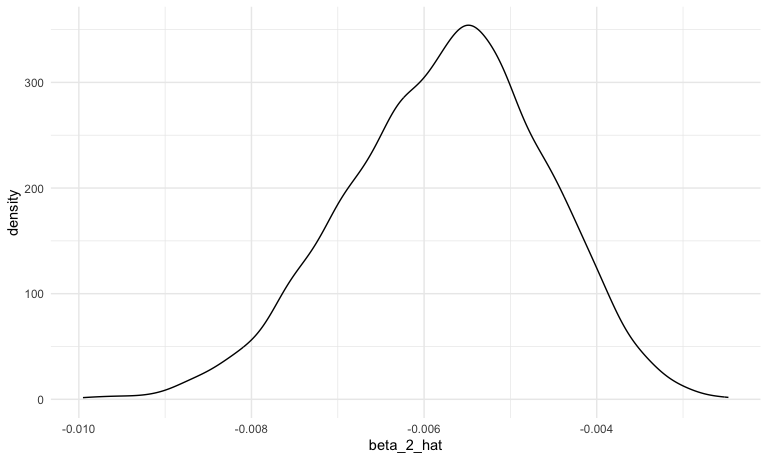

HW 6
================
Shivalika Chavan
2025-11-21

``` r
library(tidyverse)
```

    ## ── Attaching core tidyverse packages ──────────────────────── tidyverse 2.0.0 ──
    ## ✔ dplyr     1.1.4     ✔ readr     2.1.5
    ## ✔ forcats   1.0.0     ✔ stringr   1.5.1
    ## ✔ ggplot2   3.5.2     ✔ tibble    3.3.0
    ## ✔ lubridate 1.9.4     ✔ tidyr     1.3.1
    ## ✔ purrr     1.1.0     
    ## ── Conflicts ────────────────────────────────────────── tidyverse_conflicts() ──
    ## ✖ dplyr::filter() masks stats::filter()
    ## ✖ dplyr::lag()    masks stats::lag()
    ## ℹ Use the conflicted package (<http://conflicted.r-lib.org/>) to force all conflicts to become errors

``` r
library(p8105.datasets)

knitr::opts_chunk$set(echo = TRUE)
knitr::opts_chunk$set(collapse = TRUE)
knitr::opts_chunk$set(
  fig.width = 8,
  fig.asp = .6,
  out.width = "90%"
)
theme_set(theme_minimal() + theme(legend.position = "bottom"))
```

#### Problem 1

``` r
omitted_city_states = c("Dallas, TX", "Phoenix, AZ","Kansas City, MO", "Tulsa, AL")

homicide_data = read.csv("./data/homicide-data.csv") |> 
  janitor::clean_names() |> 
  mutate(
    city_state = paste0(city, ", ", state),
    homicide_solved = as.numeric(disposition == "Closed by arrest"),
    victim_age = if_else(victim_age == "Unknown", NA, victim_age),
    victim_age = as.numeric(victim_age)
  ) |> 
  filter(
    !(city_state %in% omitted_city_states)
  )
```

Additional filtering for only Problem 1:

``` r
homicide_data_problem_1 = 
  homicide_data |> 
  filter(victim_race %in% c("White", "Black"))
```

For Baltimore:

``` r
homicide_data_1_glm = 
  homicide_data_problem_1 |> 
  filter(city_state == "Baltimore, MD") |> 
  glm(formula = homicide_solved ~ victim_age + victim_sex + victim_race, data = _, family = binomial()) 

estimate_CI_OR_sex = homicide_data_1_glm |> 
  broom::tidy(conf.int = TRUE, exponentiate = TRUE) |>
  filter(term == "victim_sexMale") |> 
  select(estimate, conf.low, conf.high)

estimate_CI_OR_sex
## # A tibble: 1 × 3
##   estimate conf.low conf.high
##      <dbl>    <dbl>     <dbl>
## 1    0.426    0.324     0.558
```

Mapping to all cities

``` r
extract_estimate_OR_sex = function(city){
  
  estimates = 
    homicide_data_problem_1 |>
    filter(city_state == !!city) |>
    glm(formula = homicide_solved ~ victim_age + victim_race + victim_sex, data = _, family = binomial()) |>
    broom::tidy(conf.int = TRUE, exponentiate = TRUE) |>
    filter(term == "victim_sexMale") |>
    select(estimate, conf.low, conf.high)
  
  estimates
  
}

estimates_ORs_city = 
  tibble(
    city = unique(pull(homicide_data_problem_1, city_state))
    ) |> 
  mutate(glm_model_estimates = map(city, extract_estimate_OR_sex)) |> 
  unnest(glm_model_estimates)
## Warning: There were 43 warnings in `mutate()`.
## The first warning was:
## ℹ In argument: `glm_model_estimates = map(city, extract_estimate_OR_sex)`.
## Caused by warning:
## ! glm.fit: fitted probabilities numerically 0 or 1 occurred
## ℹ Run `dplyr::last_dplyr_warnings()` to see the 42 remaining warnings.
```

Plotting:

``` r
estimates_ORs_city |> 
  mutate(city = fct_reorder(city, estimate)) |> 
  ggplot(aes(x = estimate, y = city)) + 
  geom_point() + 
  geom_errorbarh(aes(xmin = conf.low, xmax = conf.high)) +
  geom_vline(xintercept = 1, color = "red") +
  xlim(0, 4) +
  ylab("City, State") +
  xlab("Estimate of Odds Ratio of Homicide Solved, Male vs. Female (with 95% CI)")
```



An odds ratio of 1 indicates that the odds of a homicide being solved
are equal between male and female victims, keeping all other variables
fixed (`age` and `race`). An odds ratio greater than 1 (right of the red
line) means that homicides where the victims are male have higher odds
of being solved. An odds ratio less than 1 (left of the red line) means
that homicides where the victims are male have lower odds of being
solved. If the CI does not cross 1, then it means that the calculated
odds ratio is statistically significant.

#### Problem 2

``` r
data("weather_df")

bootstrap_sample = function(df){
  
  slice_sample(df, prop = 1, replace = TRUE)
  
}

weather_df_bootstrapped_samples = 
  tibble(iter = 1:5000) |> 
  mutate(
    bootstrapped_sample = map(iter, \(i) bootstrap_sample(df = weather_df)),
    sample_linear_models = map(bootstrapped_sample, \(df) lm(tmax~tmin + prcp, data = df)),
    r_hat_sq = map(sample_linear_models, \(model) model |> broom::glance() |> pull(r.squared)),
    beta_1_hat = map_dbl(sample_linear_models, \(model) model |> broom::tidy() |> filter(term == "tmin") |> pull(estimate)),
    beta_2_hat = map_dbl(sample_linear_models, \(model) model |> broom::tidy() |> filter(term == "prcp") |> pull(estimate)),
    beta_1_2_ratio = beta_1_hat / beta_2_hat
  )
```

``` r
weather_df_bootstrapped_samples |> 
  ggplot(aes(x = beta_1_hat)) + geom_density()
```



``` r

weather_df_bootstrapped_samples |> 
  ggplot(aes(x = beta_2_hat)) + geom_density()
```



β1 appears normally distributed around 1.017. β2 also appears normally
distributed around -0.0058.

``` r
weather_df_bootstrapped_samples |> 
  select(beta_1_hat, beta_2_hat) |> 
  pivot_longer(
    cols = c(beta_1_hat, beta_2_hat),
    names_to = "estimate",
    values_to = "value"
  ) |> 
  group_by(estimate) |> 
  reframe(
    ci.lower = quantile(value, probs = 0.025),
    ci.upper = quantile(value, probs = 0.975)
  ) |> 
  knitr::kable()
```

| estimate   |   ci.lower |   ci.upper |
|:-----------|-----------:|-----------:|
| beta_1_hat |  1.0056934 |  1.0281290 |
| beta_2_hat | -0.0080995 | -0.0036465 |
